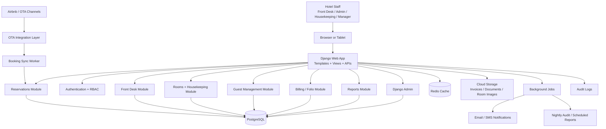
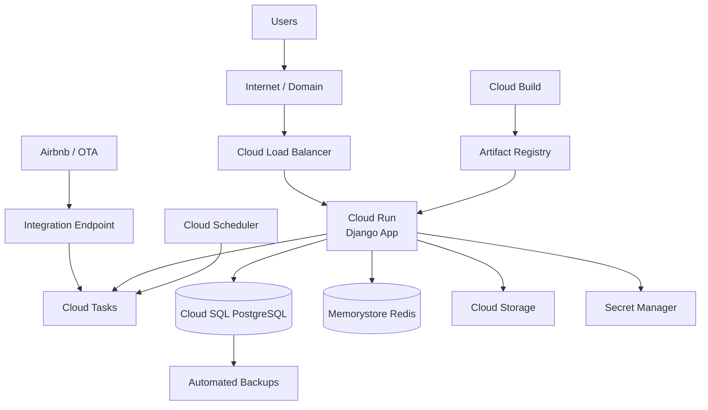

# Hotel PMS Architecture

## 1. Product Component Diagram



## 2. GCP Deployment Diagram



## 3. Recommended PMS Modules

```text
Dashboard
Reservations
Check-in / Check-out
Room Management
Housekeeping
Guest Management
Billing / Folio
Reports
Staff / Roles
Audit / Activity Logs
Admin Console
```

## 4. Recommended Tech Stack

```text
Web App       : Django
API           : Django REST Framework
Database      : PostgreSQL
Cache         : Redis
File Storage  : Google Cloud Storage
Jobs          : Cloud Tasks + Cloud Scheduler
Deploy        : Cloud Run
CI/CD         : Cloud Build + Artifact Registry
Secrets       : Secret Manager
```

## 5. MVP Scope

For the first version, keep it as:

```text
1 Django web application
1 PostgreSQL database
1 Redis cache
1 File storage bucket
1 OTA integration layer
```

This is enough for a strong hotel PMS MVP and is much easier to build than starting with microservices.

## 6. Why Django Is The Best Choice Here

```text
Internal staff-facing PMS apps benefit from:
- built-in admin
- built-in authentication and permissions
- strong CRUD and form handling
- mature ORM with PostgreSQL
- faster MVP delivery
```

## 7. Airbnb Integration Strategy

```text
Preferred production path:
Airbnb -> official software-connected integration -> our PMS

Fastest practical path for a new PMS:
Airbnb -> approved channel manager -> our PMS

Fallback only:
Airbnb iCal sync -> block availability dates
```

## 8. Booking Import Flow

```text
1. Booking arrives on Airbnb
2. Airbnb-connected software sends or exposes the reservation data
3. Our OTA integration layer receives it
4. A sync worker validates and normalizes the booking
5. The reservation is saved in PostgreSQL
6. Django shows it in the dashboard, calendar, and reservation screens
```
